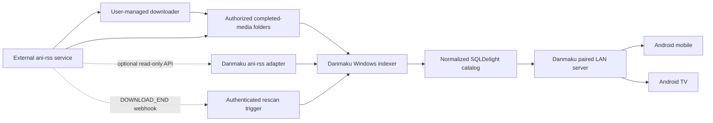

# ani-rss Integration Review

Updated on 2026-06-02.

Reference project:

```text
https://github.com/wushuo894/ani-rss
```

Analyzed reference snapshot:

```text
2fbd161eba019e0d5686f2684e2870f26c7803c9
```

## Decision Summary

Integrate ani-rss as an optional external automation adapter owned by the
Windows host. Do not embed ani-rss, its RSS acquisition logic, or a torrent
client into Danmaku.

The first implementation should import already downloaded anime from
user-selected ani-rss-managed folders through the existing Windows indexer.
Android and Android TV continue to consume Danmaku's normalized paired LAN
catalog and verified media-ID streams.

After folder import is stable, add a read-only ani-rss HTTP adapter and an
authenticated completion-webhook endpoint. Subscription creation, RSS refresh,
and torrent-control actions require a separate product-policy approval because
Danmaku supports authorized media sources only.

## What ani-rss Provides

ani-rss is a separate RSS-driven automation service. Its official
documentation describes subscription, downloader configuration, rename,
scrape, and notification workflows. It supports Transmission, qBittorrent,
Aria2, and OpenList.

The inspected `v3.1.45` snapshot exposes Spring REST controllers under `/api`.
Swagger can be enabled by configuration. API-key authentication accepts the
`api-key` header documented by Swagger; the implementation also accepts
`x-api-key` and `s`.

Relevant read-only endpoints:

| Endpoint | Use |
| --- | --- |
| `POST /api/ping` | Connection health check; no authentication required |
| `POST /api/about` | Version and capability diagnostics |
| `POST /api/listAni` | Subscription inventory |
| `POST /api/downloadPath` | Resolved output folder for a subscription |
| `POST /api/playList` | Downloaded video inventory for a subscription |
| `POST /api/torrentsInfos` | External downloader observations |

Relevant optional write endpoints:

| Endpoint | Use |
| --- | --- |
| `POST /api/addAni` | Add a subscription |
| `POST /api/setAni` | Update a subscription |
| `POST /api/deleteAni` | Remove a subscription, optionally deleting files |
| `POST /api/refreshAni` | Refresh one RSS subscription |
| `POST /api/refreshAll` | Refresh all RSS subscriptions |
| `POST /api/deleteTorrent` | Delete cached torrent files for a subscription |

ani-rss also supports configurable WebHook notifications. The inspected
implementation emits a `DOWNLOAD_END` event after completion processing, which
is suitable for requesting a bounded Danmaku library rescan.

## Integration Boundary



Danmaku should not proxy ani-rss `/api/file` responses to clients. The
inspected endpoint accepts an authenticated encoded host path and streams the
resolved file. Danmaku already has a narrower model: only indexed media IDs
resolve to verified paths. Retain that boundary for all client playback.

Do not store ani-rss response objects in the normalized library database.
Normalize useful fields at the adapter boundary and retain provenance so a
user can see that a folder or observation came from ani-rss.

## Delivery Plan

### Phase A: Import Existing Downloads

- Support multiple Windows library roots.
- Let the user select one or more ani-rss-managed completed-media folders.
- Reuse the existing incremental local indexer and SQLite cache.
- Record root provenance, last scan result, and missing-folder state.
- Treat filesystem content as authoritative for playable media.

This phase satisfies fetching already downloaded anime without requiring an
ani-rss API dependency.

### Phase B: Read-Only Monitoring

- Add an optional Windows-only ani-rss connection with base URL and API key.
- Probe `/api/ping`, then retrieve `/api/about` for diagnostics.
- Read subscriptions from `/api/listAni`.
- Resolve output folders with `/api/downloadPath`.
- Read completed episode candidates from `/api/playList`.
- Observe external download progress from `/api/torrentsInfos`.
- Map adapter DTOs into Danmaku-owned models and tolerate missing fields.
- Pin tested ani-rss versions and fall back to folder scanning when unsupported.

Use `/api/torrentsInfos` for user-visible observations only. Its response model
can include magnet and torrent URLs, which should not be copied into Danmaku's
normalized library database or logs.

### Phase C: Completion-Triggered Rescans

- Add a Windows-host endpoint dedicated to ani-rss rescan notifications.
- Require a separate generated webhook token and redact it from logs.
- Configure ani-rss WebHook notifications for `DOWNLOAD_END`.
- Trigger a bounded rescan of configured ani-rss roots.
- Debounce repeated notifications and retain periodic rescans as a fallback.

The webhook is an optimization. Correctness must not depend on delivery.

### Phase D: Optional Control Actions

Only add control actions after explicit authorized-source policy approval:

- Open the external ani-rss WebUI from Danmaku.
- Optionally create, update, and refresh subscriptions through ani-rss.
- Optionally show pause, resume, retry, or delete controls where ani-rss exposes
  an appropriate API.
- Require confirmation for file deletion.
- Keep source authorization visible to the user.

Danmaku should not reproduce ani-rss source-search or RSS parsing logic.

## Security And Compliance

- Treat ani-rss as a user-configured external service for authorized content.
- Keep RSS acquisition and external downloader configuration outside Danmaku.
- Store the ani-rss API key and webhook token in platform secure storage.
- Never log API keys, webhook tokens, magnet links, torrent URLs, or signed URLs.
- Default to LAN or VPN connections. Do not expose ani-rss or Danmaku's trusted-LAN
  server directly to the public internet.
- Validate configured schemes, timeouts, response sizes, and redirect behavior.
- Use verified indexed media IDs for playback instead of arbitrary host paths.
- Avoid `/api/config`, `/api/file`, `/api/getSubtitles`, stop, update, and config
  import/export endpoints in the Danmaku adapter.
- Require an explicit confirmation before any future destructive ani-rss action.

## Review Decisions

- [ ] Approve folder import as the first ani-rss integration slice.
- [ ] Approve optional read-only ani-rss API monitoring after folder import.
- [ ] Approve completion-triggered rescans through an authenticated webhook.
- [ ] Decide whether Danmaku may open the external ani-rss WebUI.
- [ ] Decide whether subscription and download-control actions are permitted.
- [ ] Decide whether Danmaku should support a bundled ani-rss deployment or only
  connect to a separately managed service.

## Reference Evidence

- Repository and disclaimer:
  `https://github.com/wushuo894/ani-rss`
- Official documentation:
  `https://docs.wushuo.top/`
- Quick start:
  `https://docs.wushuo.top/start`
- Subscription documentation:
  `https://docs.wushuo.top/add-rss`
- qBittorrent configuration:
  `https://docs.wushuo.top/config/download/qbittorrent`
- API path prefix:
  `https://github.com/wushuo894/ani-rss/blob/master/ani-rss-application/src/main/java/ani/rss/config/WebMvcConfig.java`
- API-key behavior:
  `https://github.com/wushuo894/ani-rss/blob/master/ani-rss-application/src/main/java/ani/rss/auth/fun/ApiKey.java`
- Subscription routes:
  `https://github.com/wushuo894/ani-rss/blob/master/ani-rss-application/src/main/java/ani/rss/controller/AniController.java`
- Downloaded episode listing and subtitle routes:
  `https://github.com/wushuo894/ani-rss/blob/master/ani-rss-application/src/main/java/ani/rss/controller/PlayController.java`
- File-serving behavior:
  `https://github.com/wushuo894/ani-rss/blob/master/ani-rss-application/src/main/java/ani/rss/controller/FileController.java`
- WebHook notification behavior:
  `https://github.com/wushuo894/ani-rss/blob/master/ani-rss-application/src/main/java/ani/rss/notification/WebHookNotification.java`
