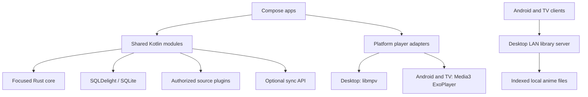
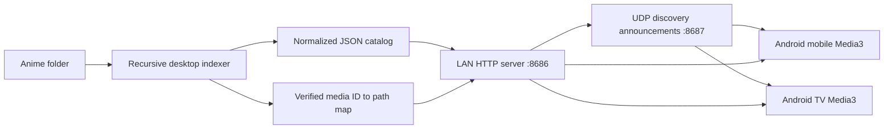
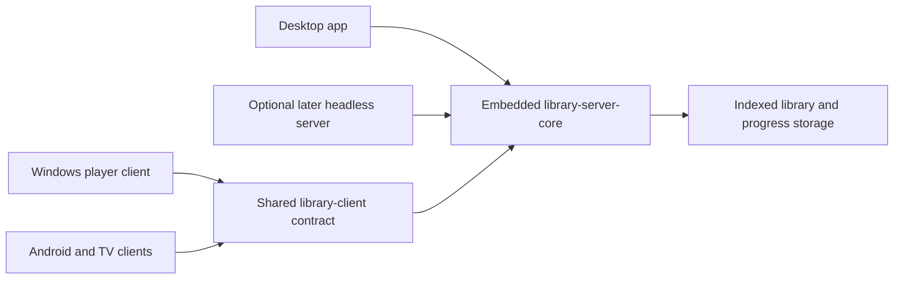
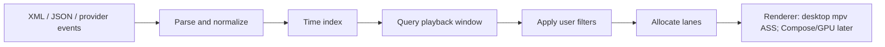

# Architecture

## Goals

Danmaku manages a local media library, streams authorized media sources,
downloads permitted content for offline playback, and renders synchronized
danmaku overlays.

The architecture prioritizes Windows, Android, and Android TV while leaving a
clear path to macOS, Linux, iOS, iPadOS, and web.

## System Shape



## Platform Matrix

| Target | UI | Playback | Downloads | Priority |
| --- | --- | --- | --- | --- |
| Windows | Compose Multiplatform Desktop | libmpv | Rust download engine | First class |
| Android | Jetpack Compose | Media3 ExoPlayer | Media3 DownloadService | First class |
| Android TV | Compose for TV | Media3 ExoPlayer | Media3 DownloadService | First class |
| macOS | Compose Multiplatform Desktop | libmpv, mpv-managed video output initially | Rust download engine | Experimental |
| Linux | Compose Multiplatform Desktop | libmpv | Rust download engine | Later |
| iOS and iPadOS | Compose Multiplatform or SwiftUI | AVPlayer | AVAssetDownloadTask | Later |
| Web | React and TypeScript | HTML video and hls.js | Limited browser storage | Later |

Android TV is a dedicated application module. It shares domain behavior with
Android mobile but owns its 10-foot layouts, focus states, and D-pad navigation.
The first TV screen explicitly requests initial focus for `Discover PC`, then
relies on Compose TV focus traversal for remote navigation.

## Repository Modules

```text
apps/
  desktop-windows/       Compose desktop app and desktop packaging
  android-mobile/        Android phone and tablet app
  android-tv/            TV-specific Compose app

shared/
  domain/                Normalized models and contracts
  library-server-core/   Reusable embedded LAN library server
  library-client/        Shared LAN library client contract and sync policy
  library-client-android Android LAN catalog client
  player-android-media3/ Shared Android and TV Media3 playback adapter
  database/              SQLDelight schema and repositories
  networking/            Ktor clients and source transport
  danmaku/               Kotlin-facing scheduling and filtering facade

native/
  rust-core/             Parsing, indexing, and later desktop download helpers
  player-windows-mpv/    Desktop libmpv adapter
```

Create modules when their first vertical slice needs them. Empty placeholder
modules are avoided.

`shared/library-server-core` is implemented as a Compose-free JVM module. The
desktop host owns indexing and SQLite persistence, then publishes a
narrow catalog and verified media-ID map to the embedded server.
`shared/library-client` owns the portable catalog, stream-URL, progress, and
resume contract plus the JVM HTTP adapter for desktop clients. Android-specific HTTP
and discovery code lives in `shared/library-client-android`. The desktop shell
uses the JVM adapter for paired-server browsing and stream selection, then
hands prepared sources to the native mpv command executor.

Currently implemented modules:

- `apps/desktop-windows`
- `apps/android-mobile`
- `apps/android-tv`
- `shared/domain`
- `shared/library-client`
- `shared/library-server-core`
- `shared/library-client-android`
- `shared/player-android-media3`
- `native/rust-core`
- `native/player-windows-mpv`

## Domain Model

The library should normalize provider-specific data into these core concepts:

```text
MediaItem
Episode
PlaybackVariant
AudioTrack
SubtitleTrack
DanmakuTrack
DanmakuEvent
DownloadManifest
DownloadJob
PlaybackProgress
```

Provider plugins may browse, search, resolve playable variants, retrieve
danmaku tracks, and report whether downloads are allowed. Provider response
types must remain at the plugin boundary.

Source descriptors expose normalized capabilities plus an authorized-download
policy before any download manifest can be created. The policy records whether
offline storage is allowed, what user or service authorization permits it,
whether playback relies on DRM, optional expiry, attribution, and terms. A
download manifest is platform-independent and stores relative output paths for
media, subtitles, danmaku tracks, and artwork; platform download engines decide
how to execute that manifest.

## Local Library Streaming

The desktop shell owns the first local-library vertical slice:



The server exposes paired `GET /api/library?token={code}`,
`GET /media/{id}?token={code}`, `GET /subtitles/{id}?token={code}`, and
`GET`/`PUT /api/progress/{id}?token={code}` requests. Media responses support
single HTTP byte ranges so Media3 can seek efficiently. Subtitle responses are
limited to indexed `ASS`, `SSA`, `SRT`, and `VTT` sidecars associated with a
catalog item. Only indexed IDs resolve to filesystem paths or progress records;
clients never submit arbitrary host paths. The shell generates and displays
a six-digit pairing code for the current server process. This first-stage HTTP
server is for trusted local networks; use a stronger authenticated and
encrypted transport before supporting untrusted networks. The intermediate
Compose app image explicitly includes the `jdk.httpserver` and `java.sql`
runtime modules. The uploaded portable Windows release is runtime-free, uses
user-installed Java 17 or newer, and includes the packaged mpv bridge plus the
separately licensed approved libmpv DLL beside the app.

The desktop host also registers authenticated provider-completion hooks on the
same server. The initial `POST /api/hooks/ani-rss/download-end` endpoint
requires a separate high-entropy `X-Danmaku-Webhook-Token` header, debounces
repeated notifications, and rescans only roots explicitly tagged as ani-rss
output folders. The token is never placed in the URL or discovery
announcements. Windows encrypts ani-rss API keys and webhook tokens with DPAPI
before persisting them in SQLDelight settings, binding those secrets to the
current Windows user. macOS and other non-Windows desktop hosts use a local
AES-GCM key under the app data directory until a platform keychain adapter is
added.

The desktop app also broadcasts a small UDP discovery announcement on port
`8687`. Android clients derive the HTTP host from the packet source and the
announced port. Pairing codes are deliberately excluded from discovery
announcements and still require explicit entry on the client.

### Server And Client Separation

Separate the LAN server and client as reusable components before shipping them
as separate Windows executables:



The desktop app starts the embedded server by default. It also retains direct
local-file playback for media on the same host. A desktop player may use
the shared LAN client contract when browsing another server or when exercising
the same-PC integration path.

An optional headless server executable is a later packaging step. Add it only
after the API, settings storage, lifecycle, diagnostics, and firewall behavior
are stable. The split should not delay the Windows libmpv playback spike.

## Playback Boundary

Shared application code owns playback intent and observable state:

```text
load(media)
play()
pause()
seek(position)
setPlaybackRate(rate)
selectAudioTrack(track)
selectSubtitleTrack(track)
observeState()
```

Platform adapters own codecs, rendering surfaces, lifecycle integration,
media sessions, hardware decoding, and DRM-capable platform APIs. Android
mobile and TV connect their UI to a shared `MediaSessionService`; the service
owns ExoPlayer and the `MediaSession` so active playback can continue after an
activity leaves the foreground. Playback snapshots expose platform-neutral
runtime audio and subtitle track state, while selection commands let platform
adapters apply engine-specific track overrides.

Android mobile and TV currently use the paired LAN progress API when a user
starts an indexed PC episode. The clients seek to stored positions only after
10 seconds of progress and restart episodes with less than 30 seconds
remaining. The `MediaSessionService` uploads a snapshot every five seconds, so
updates continue when the player screen leaves the foreground. The service
recognizes paired LAN streams from their indexed `/media/{id}?token={code}` URL
and ignores other playback sources. Shared LAN playback preparation also turns
indexed sidecars into tokenized subtitle sources; the Media3 adapter attaches
those sources to the video `MediaItem` with stable track metadata. Android
mobile and TV expose the discovered audio and subtitle tracks as selectable
controls, including a subtitle-off action.

Portable LAN client behavior lives in `shared/library-client`. Platform
adapters implement its catalog, stream-URL, progress upload, and resume lookup
contract. Android and Android TV use the existing `HttpURLConnection` adapter;
the JVM source set contains the corresponding desktop HTTP adapter and loopback
integration fixture. The desktop shell browses paired catalogs and prepares LAN
stream URLs through that adapter, then hands local or paired sources to the
native mpv controller.

The desktop adapter loads libmpv dynamically. Windows developer builds locate
`libmpv-2.dll` from `DANMAKU_LIBMPV_PATH` or beside the packaged executable;
macOS builds locate `libmpv.2.dylib` or `libmpv.dylib` from
`DANMAKU_LIBMPV_PATH`, the app directory, `/opt/homebrew/lib`, or
`/usr/local/lib`.
The desktop JNA runtime locates Danmaku's Rust bridge from
`DANMAKU_MPV_BRIDGE_PATH` or the JVM native-library search path.
The bridge accepts coarse mpv options before initialization so the Windows host
can provide `wid` without crossing the native boundary per frame.
The current Windows player parents mpv under a stable SwingPanel-backed native
child window. Because heavyweight AWT composition sits above Compose, Windows
renders indexed subtitles and danmaku as mpv subtitle/ASS tracks rather than
depending on a Compose overlay over the video surface.
macOS currently starts the same native mpv command runtime without `wid`, so
mpv owns its video output window until an embedded AppKit/Skia render path is
designed and validated.
Danmaku's Windows release directly redistributes an approved, pinned,
hash-verified LGPL libmpv DLL as a separately licensed dependency. Release
packaging includes the applicable license texts, source and provenance notice,
and exact manifest. The Compose distributable builds the Rust bridge and copies
the installed approved libmpv DLL into the app directory by default. See ADR
0002.

## Danmaku Pipeline



Rust initially owns a compact time index for normalized events. Kotlin should
request batches for a playback window. Rendering and animation remain in
platform UI/player layers so the native boundary is not crossed per frame or
per comment. Desktop playback currently uses mpv ASS subtitle rendering for
real video; Windows embeds mpv in a child-window host, while macOS lets mpv own
the output window. A future Compose or GPU renderer must first prove that it
preserves stable video composition.

The shared Kotlin lane scheduler accepts renderer-measured comment widths and
deterministically assigns scrolling comments to the first collision-free lane.
It checks spacing both when a comment enters and when the overlap window ends,
which prevents wider trailing comments from catching comments ahead of them.
The renderer can rebuild the same layout after a seek without retaining
per-frame scheduler state. Visible-comment lookup uses timestamp bounds before
filtering, so animation frames inspect the active time window rather than the
entire scheduled track.

## Storage

Use SQLite through SQLDelight for the local library, playback progress,
settings, source metadata, and download state. Store downloaded media outside
the database and record verified paths and manifests.

The Windows indexer currently persists normalized catalog rows and filesystem
stamps in SQLite. On startup it can publish the cached catalog immediately,
then walk the selected folder in the background. Files with the same relative
path, byte size, and modified timestamp reuse their cached normalized row;
added, changed, and deleted files are reflected by the replacement
transaction. Playback progress lives in a separate durable table so catalog
rescans do not discard resume positions.

## Rust Boundary

Rust is a supporting component, not the application framework. Candidate APIs:

```text
buildTimeline(events) -> Timeline
eventsInWindow(timeline, start, end) -> EventBatch
parseDanmaku(input) -> Timeline
startDesktopDownload(plan) -> DownloadId
observeDesktopDownload(id) -> ProgressEvents
```

Add Kotlin bindings after the Rust API has proven useful. Prefer UniFFI or a
small C ABI. Keep allocations and serialization visible in performance tests.

## Backend

Cloud services are optional for the first local vertical slice. When needed,
use a small Ktor service with PostgreSQL, Redis, S3-compatible storage, and
WebSockets for live danmaku rooms and synchronization.

## Security And Compliance

- Download content only when the source permits offline storage.
- Keep credentials in platform secure storage.
- Do not log tokens, cookies, or signed media URLs.
- Do not implement DRM circumvention.
- Validate filenames, paths, manifests, and remote input.
