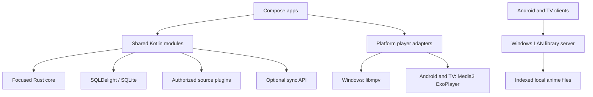
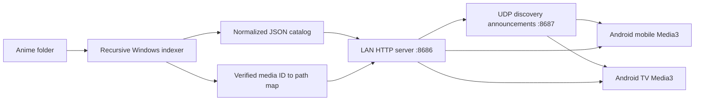
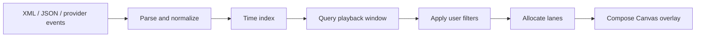

# Architecture

## Goals

Danmaku manages a local media library, streams authorized media sources,
downloads permitted content for offline playback, and renders synchronized
danmaku overlays.

The architecture prioritizes Windows, Android, and Android TV while leaving a
clear path to macOS, Linux, iOS, iPadOS, and web.

## Workspace

The canonical checkout is `S:\Projects\Danmaku`. Any old
`C:\Users\energy\OneDrive\Documents\Danmaku` directory is a stale empty
placeholder and must not be used as a repository workspace.

## System Shape



## Platform Matrix

| Target | UI | Playback | Downloads | Priority |
| --- | --- | --- | --- | --- |
| Windows | Compose Multiplatform Desktop | libmpv | Rust download engine | First class |
| Android | Jetpack Compose | Media3 ExoPlayer | Media3 DownloadService | First class |
| Android TV | Compose for TV | Media3 ExoPlayer | Media3 DownloadService | First class |
| macOS and Linux | Compose Multiplatform Desktop | libmpv | Rust download engine | Later |
| iOS and iPadOS | Compose Multiplatform or SwiftUI | AVPlayer | AVAssetDownloadTask | Later |
| Web | React and TypeScript | HTML video and hls.js | Limited browser storage | Later |

Android TV is a dedicated application module. It shares domain behavior with
Android mobile but owns its 10-foot layouts, focus states, and D-pad navigation.
The first TV screen explicitly requests initial focus for `Discover PC`, then
relies on Compose TV focus traversal for remote navigation.

## Repository Modules

```text
apps/
  desktop-windows/       Compose desktop app and Windows packaging
  android-mobile/        Android phone and tablet app
  android-tv/            TV-specific Compose app

shared/
  domain/                Normalized models and contracts
  library-client-android Android LAN catalog client
  player-android-media3/ Shared Android and TV Media3 playback adapter
  database/              SQLDelight schema and repositories
  networking/            Ktor clients and source transport
  danmaku/               Kotlin-facing scheduling and filtering facade

native/
  rust-core/             Parsing, indexing, and later desktop download helpers
  player-windows-mpv/    Windows libmpv adapter
```

Create modules when their first vertical slice needs them. Empty placeholder
modules are avoided.

Currently implemented modules:

- `apps/desktop-windows`
- `apps/android-mobile`
- `apps/android-tv`
- `shared/domain`
- `shared/library-client-android`
- `shared/player-android-media3`
- `native/rust-core`
- `native/player-windows-mpv`

## Domain Model

The library should normalize provider-specific data into these core concepts:

```text
MediaItem
Episode
PlaybackVariant
AudioTrack
SubtitleTrack
DanmakuTrack
DanmakuEvent
DownloadManifest
DownloadJob
PlaybackProgress
```

Provider plugins may browse, search, resolve playable variants, retrieve
danmaku tracks, and report whether downloads are allowed. Provider response
types must remain at the plugin boundary.

## Local Library Streaming

The Windows desktop shell owns the first local-library vertical slice:



The server exposes paired `GET /api/library?token={code}` and
`GET /media/{id}?token={code}` requests. Media responses support single HTTP
byte ranges so Media3 can seek efficiently. Only indexed IDs resolve to
filesystem paths; clients never submit arbitrary Windows paths. The shell
generates and displays a six-digit pairing code for the current server
process. This first-stage HTTP server is for trusted local networks; use a
stronger authenticated and encrypted transport before supporting untrusted
networks. The Windows distributable explicitly includes the `jdk.httpserver`
and `java.sql` runtime modules.

The Windows app also broadcasts a small UDP discovery announcement on port
`8687`. Android clients derive the HTTP host from the packet source and the
announced port. Pairing codes are deliberately excluded from discovery
announcements and still require explicit entry on the client.

## Playback Boundary

Shared application code owns playback intent and observable state:

```text
load(media)
play()
pause()
seek(position)
setPlaybackRate(rate)
selectAudioTrack(track)
selectSubtitleTrack(track)
observeState()
```

Platform adapters own codecs, rendering surfaces, lifecycle integration,
media sessions, hardware decoding, and DRM-capable platform APIs. Android
mobile and TV connect their UI to a shared `MediaSessionService`; the service
owns ExoPlayer and the `MediaSession` so active playback can continue after an
activity leaves the foreground.

The Windows adapter loads libmpv dynamically. Developer builds locate
`libmpv-2.dll` from `DANMAKU_LIBMPV_PATH` or beside the packaged executable.
Release packaging must use an audited, pinned libmpv bundle and include the
applicable license notices. See ADR 0002.

## Danmaku Pipeline



Rust initially owns a compact time index for normalized events. Kotlin should
request batches for a playback window. Rendering and animation remain in
Compose so the native boundary is not crossed per frame or per comment.

The shared Kotlin lane scheduler accepts renderer-measured comment widths and
deterministically assigns scrolling comments to the first collision-free lane.
It checks spacing both when a comment enters and when the overlap window ends,
which prevents wider trailing comments from catching comments ahead of them.
The renderer can rebuild the same layout after a seek without retaining
per-frame scheduler state. Visible-comment lookup uses timestamp bounds before
filtering, so animation frames inspect the active time window rather than the
entire scheduled track.

## Storage

Use SQLite through SQLDelight for the local library, playback progress,
settings, source metadata, and download state. Store downloaded media outside
the database and record verified paths and manifests.

The Windows indexer currently persists normalized catalog rows and filesystem
stamps in SQLite. On startup it can publish the cached catalog immediately,
then walk the selected folder in the background. Files with the same relative
path, byte size, and modified timestamp reuse their cached normalized row;
added, changed, and deleted files are reflected by the replacement
transaction.

## Rust Boundary

Rust is a supporting component, not the application framework. Candidate APIs:

```text
buildTimeline(events) -> Timeline
eventsInWindow(timeline, start, end) -> EventBatch
parseDanmaku(input) -> Timeline
startDesktopDownload(plan) -> DownloadId
observeDesktopDownload(id) -> ProgressEvents
```

Add Kotlin bindings after the Rust API has proven useful. Prefer UniFFI or a
small C ABI. Keep allocations and serialization visible in performance tests.

## Backend

Cloud services are optional for the first local vertical slice. When needed,
use a small Ktor service with PostgreSQL, Redis, S3-compatible storage, and
WebSockets for live danmaku rooms and synchronization.

## Security And Compliance

- Download content only when the source permits offline storage.
- Keep credentials in platform secure storage.
- Do not log tokens, cookies, or signed media URLs.
- Do not implement DRM circumvention.
- Validate filenames, paths, manifests, and remote input.
