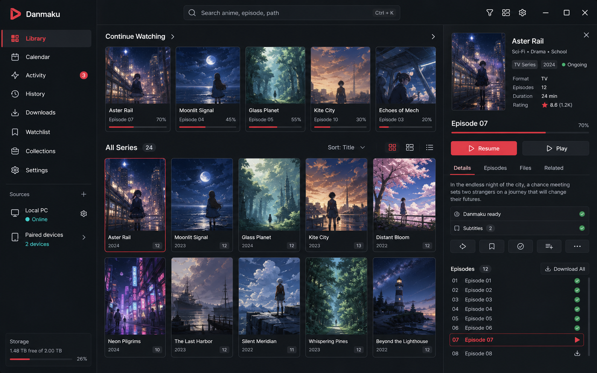

# Windows Library UI Redesign

Updated on 2026-06-08.

## Review Mockup

This image is a visual direction generated for review. It is not an exact
implementation spec; the written structure below is the source of truth for
copy, behavior, and component responsibilities.

## Problem

The current Windows library UI exposes useful functionality, but it still feels
like an internal diagnostics screen rather than a polished media library. The
main issues are:

- Library management, browsing, prepared playback, provider cache state, and
  paired-client controls all compete in one long vertical page.
- The user has to understand internal concepts such as "prepare" before the
  primary action, which should usually be play or resume.
- Series, episode detail, and prepared playback are rendered as separate
  stacked sections, so the selected item loses context.
- The sidebar has counts, but it does not yet behave like navigation between
  real library views.
- Poster cards work, but the page around them lacks hierarchy, persistent
  actions, and a professional inspector/details pattern.
- Provider and danmaku status are important, but they should be compact
  readiness signals in the library view, with detailed controls available only
  after the user asks for them.

## Design Goals

1. Make Windows feel like the primary library host, not a test harness.
2. Put the most common action first: resume, play, or continue watching.
3. Keep diagnostics and cache management available without letting them dominate
   the browsing surface.
4. Preserve high-density desktop ergonomics: keyboard search, sort, filters,
   fast scanning, and visible file/source status.
5. Keep the design feasible in Compose Desktop with the current domain models.
6. Avoid layouts that would fight the stable native mpv host or require a large
   playback rewrite.

## Proposed Information Architecture

The Library tab should become a three-pane workspace:

- Left rail: persistent navigation, source status, storage, and library roots.
- Center content: selected library view, search, filters, progress rails, and
  series grid or episode list.
- Right inspector: selected series or episode details, direct playback actions,
  readiness status, and secondary tools.

Primary views in the left rail:

- Continue Watching
- Next Up
- All Series
- Recently Watched
- Favorites
- Files
- Paired Library

The current paired-library browser can remain in the Library tab, but it should
be a selected left-rail view instead of a full section below the local library.

## Target Layout

### App Header

The top bar should be compact and persistent:

- Back/forward navigation within library selection history.
- Global search input: `Search anime, episode, path`.
- Filter button with active count.
- View toggle: poster grid, compact list, file list.
- Settings or library-management action.

Avoid large page titles. The active rail item already establishes context.

### Left Rail

The left rail should carry app-level orientation:

- Brand: `Danmaku`.
- Navigation items with counts and selected/focus state.
- Source block:
  - `Local PC` with online/server state.
  - `Paired devices` with device count.
  - Add source/root action.
- Storage block:
  - free/total space
  - small quota/progress bar

This rail replaces the current standalone "Local Media Library" control block
for normal browsing. Add/rescan actions move into source management or the
header menu.

### Center Content

The center pane should prioritize media:

- Continue Watching rail at top when non-empty.
- Next Up can be a rail or merged into Continue Watching depending on data.
- `All Series` grid below, with count and sort controls.
- Optional list mode for users who prefer dense file-oriented browsing.

Poster cards should include:

- Cover image or deterministic poster placeholder.
- Series title.
- Year or source metadata when available.
- Episode count.
- Watched/new/in-progress summary.
- Progress stripe for selected or in-progress series.
- Favorite marker only when active, not a persistent text button.

Card actions:

- Single click selects and updates inspector.
- Double click or primary inline action resumes/plays the next playable episode.
- Context menu exposes prepare, rescan metadata, favorite, reveal file, and
  provider tools.

### Right Inspector

The right inspector replaces stacked `Series Detail`, `Episode Detail`, and
most of `Prepared Playback`.

For a selected series:

- Poster/banner.
- Title, year, format, episode count, duration if known.
- Watch progress and next recommended episode.
- Primary actions: `Resume` or `Play`, plus secondary `Details`.
- Readiness rows:
  - `Danmaku ready`
  - `Subtitles 2`
  - `Local file available`
  - `LAN stream ready`
- Tabs:
  - Details
  - Episodes
  - Files
  - Related or Providers

For a selected episode:

- Episode title and progress.
- Primary action: `Resume` or `Play`.
- Secondary actions: favorite, attach danmaku, refresh danmaku, more.
- Episode list remains visible so navigation does not jump the page.

Prepared playback should become an internal selected-episode state:

- Normal users see `Ready`, `Loading`, `Danmaku ready`, or a warning.
- Advanced details can be opened from a `More` or `Diagnostics` menu.
- Previous/next episode actions live in the inspector episode list and keyboard
  shortcuts, not in a wide button row.

## Visual System

Use a restrained dark interface:

- Background: near-black graphite.
- Panels: neutral dark gray, not blue-heavy.
- Primary accent: current Danmaku red.
- Secondary status accents: cyan for connected/online, green for ready/success,
  amber/red for warnings.
- Radius: 6 to 8 dp for cards and controls.
- Dividers: subtle 1 dp lines.
- Typography: compact desktop scale. Avoid hero-size text inside panels.

Buttons:

- Use icon buttons for common commands: play, resume, favorite, filter, sort,
  view mode, more, refresh.
- Use text buttons only for clear primary actions such as `Resume`, `Play`, and
  `Download All`.
- Do not render long rows of equally weighted buttons.

## Empty And Loading States

The library should look intentional even with no content:

- Empty local library: centered setup state in the center pane, with one primary
  `Add folder` action and a smaller `Import ani-rss output` action.
- Indexing: show source-level scan progress in the left rail and non-blocking
  skeletons in the center pane.
- No filter results: show active filters and a `Reset filters` action.
- Missing root: show the affected root in the source block with a warning state,
  not only a metadata row.

## Interaction Details

Keyboard:

- `Ctrl+K`: focus search.
- `Enter`: play/resume selected item.
- Arrow keys: move selection in grid/list.
- `F`: favorite selected item.
- `R`: refresh selected danmaku or metadata only when the inspector is focused.

Mouse:

- Single click selects.
- Double click plays/resumes.
- Right click opens contextual menu.
- Hover can reveal compact card actions, but primary status must remain visible
  without hover.

Focus:

- Maintain a visible focus ring for keyboard users.
- Selection and focus should be different states.
- Keep selected inspector stable while filters update unless the selected item
  disappears.

## Data Needed From Current Code

The first version can use existing models:

- `LibrarySeries` for grid cards and selected-series inspector.
- `LibraryEpisodeDetail` for selected-episode inspector.
- `LibraryPlaybackProgressItem` and `LibraryNextUpItem` for rails.
- `LibraryWatchStatus` and `LibrarySeriesWatchSummary` for progress badges.
- `DesktopLocalPlaybackPreparation` for readiness details, but shown only as
  compact state unless diagnostics are expanded.
- Existing favorite IDs and subtitle counts.

Future metadata fields:

- poster/banner artwork from metadata providers
- canonical year/season/format
- synopsis
- provider identity and mapping confidence
- per-episode thumbnail or still

## Implementation Plan

### Phase 1: Layout Shell

- Replace the long vertical Library tab with a three-pane workspace.
- Move local/paired source controls into a left rail.
- Keep existing `LocalLibraryGallery` data flow, but split it into rail, center,
  and inspector composables.
- Keep paired library as a selected rail view.

### Phase 2: Center Library View

- Add real left-rail navigation state.
- Promote Continue Watching and Next Up to horizontal rails.
- Make All Series the default center view.
- Add grid/list view mode state.
- Move search/sort/filter controls into a compact toolbar.

### Phase 3: Inspector

- Merge series detail, episode detail, and prepared playback into one inspector.
- Make `Resume` or `Play` the primary action.
- Hide danmaku cache/provider controls under secondary menus.
- Keep advanced diagnostics reachable but visually subordinate.

### Phase 4: Polish

- Add keyboard selection and shortcuts.
- Add card focus/selection states.
- Improve missing-cover placeholders.
- Add empty/loading/no-results states.
- Run a visual QA pass at 1366x768, 1440x900, 1920x1080, and ultrawide.

## Open Review Questions

- Should `Paired Library` live in the same left rail as local views, or remain a
  separate top-level tab?
- Should the first public release include a file-list mode, or only poster grid
  plus selected-series episode list?
- Which advanced actions should remain visible by default: attach danmaku,
  refresh danmaku, clear cache, reveal file, or prepare?
- Should the library inspector persist while switching between local and paired
  sources?
- Do we want a dedicated `Downloads` rail item now, or wait until the download
  engine is implemented?

## Acceptance Criteria

- A user can open Library and immediately understand what to continue watching.
- The default visible action for an episode is `Resume` or `Play`, not
  `Prepare`.
- Selecting a series updates the inspector without scrolling the page.
- Provider/cache/danmaku details are visible as readiness signals and warnings,
  not as raw diagnostic blocks.
- Search, filters, and sort remain reachable in one glance.
- The UI scales cleanly to a 1366x768 desktop window without overlapping text or
  clipped primary actions.
